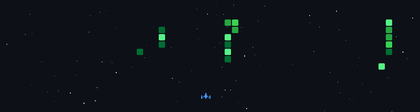

<!--
**MrTambe-jpg/MrTambe-jpg** is a ✨ _special_ ✨ repository because its `README.md` (this file) appears on your GitHub profile.

Here are some ideas to get you started:

- 🔭 I’m currently working on ...
- 🌱 I’m currently learning ...
- 👯 I’m looking to collaborate on ...
- 🤔 I’m looking for help with ...
- 💬 Ask me about ...
- 📫 How to reach me: ...
- 😄 Pronouns: ...
- ⚡ Fun fact: ...
-->

# 💫 About Me:
I'm currently working on Personal Projects I'm looking to collaborate on Open source projects I'm looking for help with Codes Idea's & Brainstroms I'm currently learning Ai/Ml Ask me about VibeCode + Fun fact: I use Ai like a Slave

  

## 🌐 Socials:
 

# 💻 Tech Stack:
### 🛠️ Languages & Tools

#### 💻 Programming Languages

  
  
  
  
  
  
  

#### 🌐 Web & Frameworks

  
  
  
  
  
  

#### 📱 Mobile & Desktop Apps

  
  
  

#### 🤖 AI, Data Science & Graphics

  
  
  
  
  
  
  

#### ⚙️ Backend, Database & Cloud

  
  
  
  

#### 🛠️ Dev Tools & Others

  
  
  
  
  
  
  
  

---
# 📊 GitHub Stats:
 
 

## 🏆 GitHub Trophies

### ✍️ Random Dev Quote

---
<!-- Proudly created with GPRM ( https://gprm.itsvg.in ) -->
